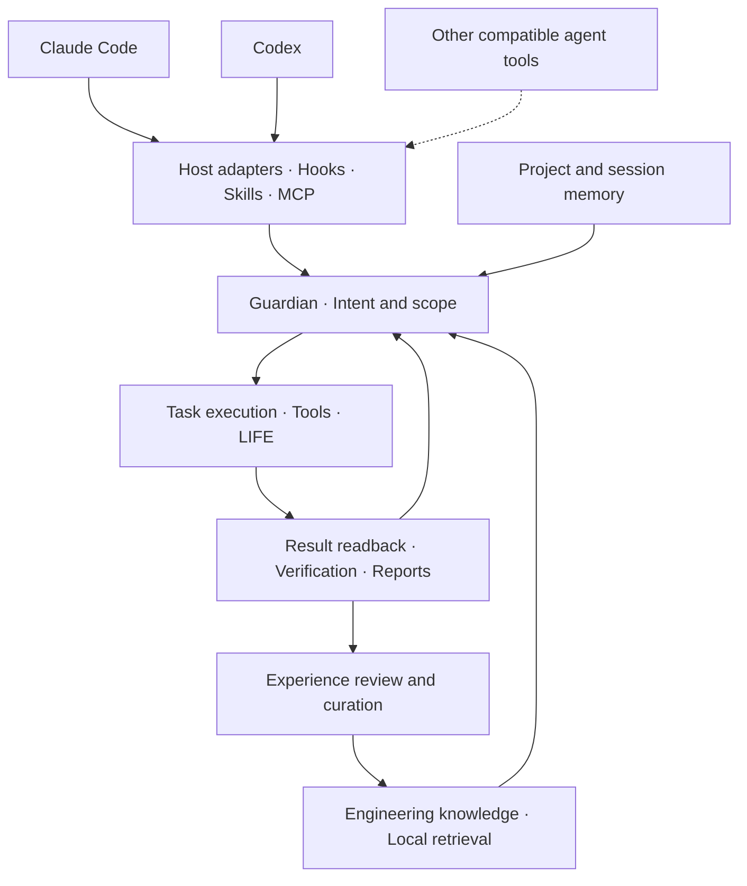

# Sulde

**An extensible harness for AI agent tools**

**English** | [简体中文](README.zh-CN.md)

[](LICENSE)
[](docs/DEVELOPMENT.md)
[](docs/DEVELOPMENT.md)

Sulde provides intent supervision, task execution and verification, knowledge retrieval,
and cross-session memory for AI coding agents. Host adapters, hooks, skills, and MCP services
connect task objectives, tool operations, and delivery evidence in a traceable engineering workflow.
Tools that implement compatible interfaces can reuse the corresponding capabilities. The repository
currently provides host adapters for Claude Code and Codex.

**Source available for noncommercial use.** See the [licensing guide](docs/LICENSING.md)
for permitted uses and historical license rights.

[Features](#features) · [Architecture](#architecture) · [Quick start](#quick-start) · [Examples](#examples) · [Documentation](#documentation) · [Contributing](#contributing) · [License](#license)

## Overview

Sulde supports agent workflows that need persistent context, explicit execution boundaries,
and verifiable deliverables. It records user objectives and acceptance criteria as task contracts,
tracks observable actions and outcomes during execution, and makes engineering knowledge and
session history available as traceable references for future work.

Integration follows protocols and host capabilities. Compatible tools can use the exposed MCP and
CLI interfaces, while host adapters connect lifecycle events, permission decisions, and execution
results to the shared core. The included Claude Code and Codex adapters each operate independently
and can share local knowledge and memory when configured. The framework includes project templates
for Android, iOS, Flutter, and HarmonyOS; its core supervision and knowledge mechanisms can also
support other engineering projects.

This repository contains a **source candidate** of the full Harness. Host installation, permission
handling, and background scheduling must be verified in each target environment. See
[Development and packaging](docs/DEVELOPMENT.md) for compatibility and acceptance requirements.

## Features

- **Intent supervision** — Guardian maintains revisable objectives, execution boundaries, and acceptance criteria, with records of user corrections and boundary violations.
- **Verifiable execution** — Task contracts, isolated worktrees, tool-result readbacks, and delivery reports support task acceptance.
- **Engineering knowledge retrieval** — Keyword and vector search retrieve relevant knowledge while retaining source paths and applicability conditions for verification.
- **Cross-session memory** — Store, retrieve, and organize project and session information to recover the context needed for later tasks.
- **Constrained automation** — LIFE provides background tasks and layered governance within configured permissions and acceptance conditions.
- **Integration through compatible protocols** — Reuse MCP and CLI capabilities from compatible tools, and extend host adapters for supervision and execution. Claude Code and Codex adapters are included.
- **Extensible project toolkit** — Project diagnostics, skill and hook generators, knowledge containers, and templates for multiple platforms.

## Architecture



The adapter layer integrates native host events and tools. The core maintains task and execution
state, while knowledge and memory provide historical references. Search results require checking
the original sources, and tool calls require verification of their effects. Switching hosts does
not automatically transfer state or authority. See the [host contract](docs/dual-runtime-contract.md)
and [intent supervision reference](docs/intent-guardian.md), both currently in Chinese.

### Protocol compatibility

Compatibility is evaluated for the capabilities a tool uses:

| Integration surface | What a compatible tool needs |
| --- | --- |
| Knowledge and memory tools | An MCP client supporting this server's stdio transport, initialization, tool discovery, and tool calls |
| Project toolkit | Ability to invoke the documented CLI commands and consume their outputs |
| Skill instructions | Ability to load the relevant instructions and resolve their referenced commands, tools, and runtime paths |
| Full supervision and managed execution | A host adapter mapping session and tool events, native permission decisions, execution results, and process lifecycle to Sulde's contracts |

The shipped host adapters and provider selectors currently cover Claude Code and Codex. Another
tool can reuse matching interfaces; full host integration requires the corresponding adapter and
validation. An MCP connection alone does not establish compatibility with the complete supervision
workflow. See [Adding a compatible host](docs/DEVELOPMENT.md#adding-a-compatible-host).

## Quick start

### Requirements

| Component | Requirement |
| --- | --- |
| Python | 3.10–3.14 |
| Basic tools | Git and PyYAML 6.0+ |
| Agent tool | Compatible MCP/CLI interfaces for selected capabilities; a validated host adapter for the full Harness. Claude Code and Codex adapters are included |
| Knowledge and memory engines | Additional indexing dependencies and models configured during bootstrap |

The standalone project toolkit runs without starting an agent host, model, or MCP service.

### Install the source toolkit

```sh
git clone https://github.com/EthanReedLabs/sulde.git
cd sulde
python3 -m venv .venv
```

Activate the environment and check the installation:

```sh
# macOS / Linux
. .venv/bin/activate
python3 -m pip install -r hooks/requirements.txt
python3 -B scripts/sulde.py doctor --strict
```

<details>
<summary>Windows / PowerShell</summary>

```powershell
.venv\Scripts\python.exe -m pip install -r hooks/requirements.txt
.venv\Scripts\python.exe -B scripts/sulde.py doctor --strict
```

On Windows, replace `python3` in the following examples with `.venv\Scripts\python.exe`.

</details>

`doctor` checks the source layout, basic dependencies, plugin manifests, and project toolkit.
Run the examples below from the repository root.

### Integrate an agent host

The full Harness requires a package for the selected host and initialization of the knowledge
and memory runtime:

| Host | Integration |
| --- | --- |
| Claude Code | Build the Claude plugin package and configure its runtime using the [host contract](docs/dual-runtime-contract.md) (Chinese) |
| Codex | Build a POSIX or Windows plugin package and use the repository installer to bind and verify the Codex executable |
| Other compatible tools | Connect through matching MCP/CLI interfaces; follow the [host integration requirements](docs/DEVELOPMENT.md#adding-a-compatible-host) for full supervision and execution |

Build commands, runtime dependencies, audited CLI versions, and verification requirements are
maintained in [Development and packaging](docs/DEVELOPMENT.md). Initialization can download
models and write local data; use a separate test environment for the first integration.

## Examples

### Create a project knowledge base

Initialize empty knowledge containers in a separate example directory, validate their format,
and generate an index:

```sh
mkdir -p .tmp/sulde-demo
python3 -B scripts/sulde.py kb init --root .tmp/sulde-demo
python3 -B scripts/sulde.py kb lint --root .tmp/sulde-demo
python3 -B scripts/sulde.py kb index --root .tmp/sulde-demo
```

The knowledge base lives in `.tmp/sulde-demo/knowledge/`. Its containers start empty. Follow the
[Knowledge Kit guide](docs/KNOWLEDGE-KIT.md) to add reviewed Markdown documents, then search by symptom:

```sh
python3 -B scripts/sulde.py kb search --root .tmp/sulde-demo "stale data overwrites newer data during cache refresh"
```

This CLI uses local lexical matching. The full Harness's hybrid retrieval engine is initialized
separately. An empty knowledge base returns an empty result.

### Define a verifiable agent task

After integrating a host, describe a task using this structure so intent supervision and task
tooling can record, execute, and verify it:

```text
Objective: Fix stale data overwriting newer data after a cache refresh.
Scope: The cache module and its regression tests; preserve the public API.
Acceptance: Concurrent refresh cases and existing tests pass; include a change summary and command results.
Knowledge: Retrieve relevant cases and check their sources; draft a knowledge candidate once the conclusion has evidence.
```

See the [task authoring specification](spec/task-authoring.md) for the task contract and
[event observability (Chinese)](docs/event-observability.md) for verifying tool and external effects.

## Documentation

| Topic | References |
| --- | --- |
| Core mechanisms (Chinese) | [Intent supervision](docs/intent-guardian.md) · [Host integration](docs/dual-runtime-contract.md) · [Event observability](docs/event-observability.md) |
| Task protocol | [Task authoring](spec/task-authoring.md) · [Task contract](spec/task-contract.md) |
| Knowledge and extensions | [Knowledge Kit](docs/KNOWLEDGE-KIT.md) · [Retrieval contract (Chinese)](docs/kb-retrieval-contract.md) · [Extension guide](docs/EXTENDING.md) |
| Development | [Development and packaging](docs/DEVELOPMENT.md) · [Changelog](CHANGELOG.md) · [Contributing](CONTRIBUTING.md) |
| Data and licensing | [Public data boundary](docs/PUBLIC-DATA-BOUNDARY.md) · [Licensing guide](docs/LICENSING.md) · [Notices](NOTICE) · [Third-party inventory](THIRD_PARTY_NOTICES.md) |

The project overview, development guide, licensing guide, and third-party inventory are available in English and
Simplified Chinese. Other documents retain their original language, as indicated above.
Documentation translations do not imply that CLI output or every skill is localized.

Historical Community guides describe the standalone toolkit; their older capability inventories
do not describe the current full Harness.

## Data and privacy

The repository distributes the framework and empty knowledge containers. Engineering knowledge,
project and session memory, indexes and vectors, production logs, installation receipts, internal
reports, credentials, and private Git history are not bundled. Runtime data lives in the user's
configured local Sulde directory. Model calls and external services follow the actual deployment's
data configuration.

Tests should use synthetic data. Before sharing logs, filing issues, or distributing a derived
package, review the [public data boundary](docs/PUBLIC-DATA-BOUNDARY.md) and remove sensitive content.

## Contributing

Documentation fixes, reproducible bug reports, platform compatibility improvements, and
improvements to the reusable framework and toolkit are welcome.

1. Describe the issue, reproduction steps, and expected behavior in [Issues](https://github.com/EthanReedLabs/sulde/issues).
2. Follow the [contribution guidelines](CONTRIBUTING.md) to establish scope; discuss core protocol or license changes first.
3. Submit a pull request focused on one issue and include verification results.

Do not post raw sensitive material in public issues. Contact the
[maintainer](mailto:eric.gao.tech@gmail.com) when needed. Contributors retain their copyright;
the repository's contribution licensing terms apply.

## License

New material released under the current terms uses the
[PolyForm Noncommercial License 1.0.0](LICENSE). It allows use, modification, and redistribution
for its permitted purposes and **does not grant commercial use**. Internal commercial development,
paid client delivery, resale, and commercial hosting are outside that grant; the standard license's
express permissions for educational, charitable, and other specified organizations remain intact.

Sulde is **source available**. Previously granted MIT and BSL rights remain effective for historical
material, and the new license has no automatic MIT conversion date. See the
[licensing guide](docs/LICENSING.md) for the full scope.
