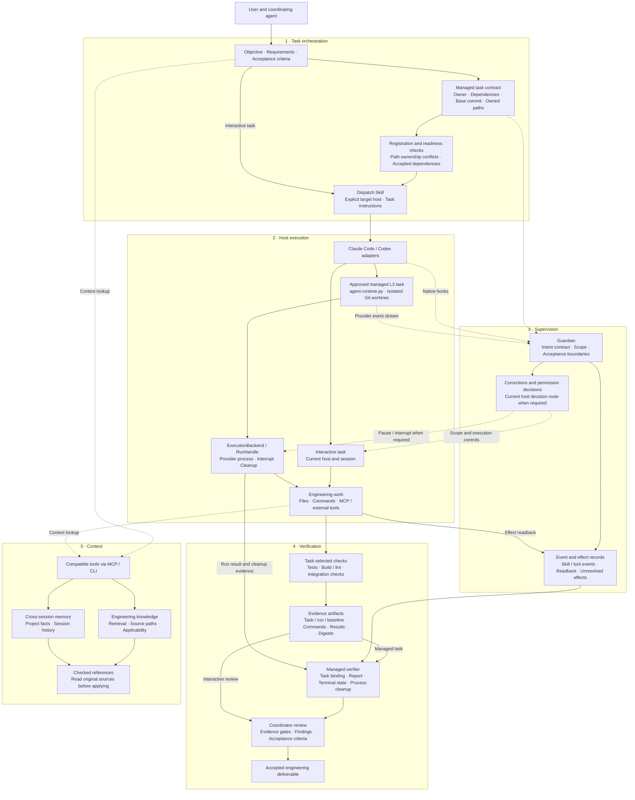
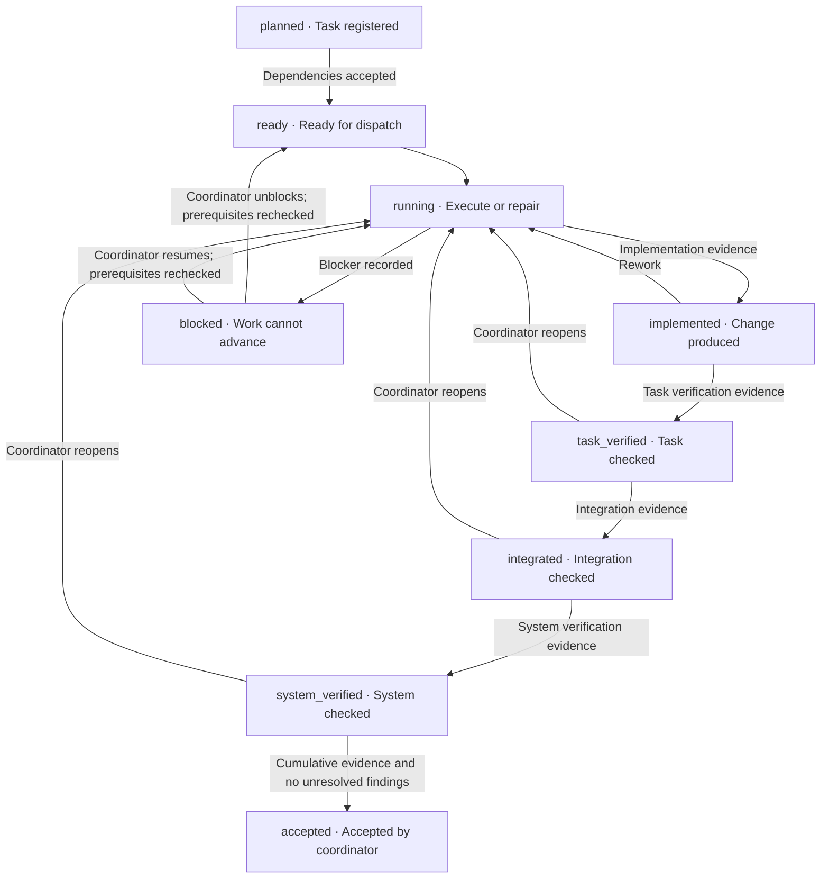

# Sulde

**Task orchestration and engineering delivery for AI agents**

**English** | [简体中文](README.zh-CN.md)

[](LICENSE)
[](docs/DEVELOPMENT.md)
[](docs/DEVELOPMENT.md)

Sulde is a task orchestration and engineering delivery framework for AI agents. It covers task
definition and assignment, execution supervision, engineering checks, result verification, and
acceptance and rework, with knowledge retrieval and cross-session memory providing context.
Tools with compatible MCP/CLI interfaces can reuse the corresponding capabilities. Claude Code
and Codex adapters are included; full supervision requires host adaptation and validation.

Sulde is independently developed and maintained by an individual developer.

**Source available for noncommercial use.** See the [licensing guide](docs/LICENSING.md)
for permitted uses and historical license rights.

[Features](#features) · [Architecture](#architecture) · [Quick start](#quick-start) · [Examples](#examples) · [Documentation](#documentation) · [Contributing](#contributing) · [License](#license)

## Overview

Sulde organizes engineering work around explicit tasks: who owns each task, what it depends on,
which paths it may change, and what evidence is needed for acceptance. Dispatch instructions
target the selected host. For approved managed L3 tasks, the runtime executes in isolated Git
worktrees and verifies the resulting artifacts and execution state.

The coordinator checks evidence before advancing a managed task through implementation, task
verification, integration, system verification, and acceptance. Unresolved findings block
verification and acceptance; the coordinator can reopen work for repair and check it again.
Task decomposition, assignment, check selection, and judgment of the result remain explicit
work by the user and coordinating agent. These mechanisms do not imply that arbitrary requests
are automatically split, scheduled, or accepted.

Integration follows protocols and host capabilities. Compatible tools can use the exposed MCP and
CLI interfaces, while host adapters connect lifecycle events, permission decisions, and execution
results to the shared core. The included Claude Code and Codex adapters each operate independently
and can share local knowledge and memory when configured. The framework includes project templates
for Android, iOS, Flutter, and HarmonyOS; its core supervision and knowledge mechanisms can also
support other engineering projects.

This repository contains a **source candidate** of the full Harness. Host installation, permission
handling, and background scheduling must be verified in each target environment. See
[Development and packaging](docs/DEVELOPMENT.md) for compatibility and acceptance requirements.

## Features

- **Task definition and assignment** — Managed task contracts record an owner, dependencies, a base commit, owned paths, acceptance criteria, and evidence gates. Registration checks path ownership conflicts; state transitions require accepted dependencies.
- **Host-aware dispatch and isolated execution** — The dispatch Skill prepares instructions for the selected host. Approved managed L3 tasks use `agent-runtime.py` to run and verify work in isolated Git worktrees; ordinary interactive tasks use the current host.
- **Execution supervision** — Guardian tracks objectives, scope, user corrections, and observable Skill/MCP/tool actions through host hooks or managed execution streams.
- **Engineering checks and result verification** — Run checks chosen for the task, retain results tied to the tested inputs, and read back tool effects. The managed verifier checks task bindings, delivery reports, and terminal execution state; a passing command alone does not establish acceptance.
- **Acceptance and rework** — The managed program distinguishes implementation, task verification, integration, system verification, and acceptance. Coordinator-controlled transitions require evidence and resolved findings; reopened work must be verified again.
- **Engineering knowledge retrieval** — Keyword and vector search retrieve relevant knowledge while retaining source paths and applicability conditions for verification.
- **Cross-session memory** — Store, retrieve, and organize project and session information to recover the context needed for later tasks.
- **Constrained automation** — LIFE provides background tasks and layered governance within configured permissions and acceptance conditions.
- **Integration through compatible protocols** — Reuse MCP and CLI capabilities from compatible tools, and extend host adapters for supervision and execution. Claude Code and Codex adapters are included.
- **Extensible project toolkit** — Project diagnostics, skill and hook generators, knowledge containers, and templates for multiple platforms.

## Architecture

### Components and execution boundaries



Solid arrows show work and evidence flow; dashed arrows show context, observed events, and
supervision. The task registration gates and managed verifier apply to the managed path;
ordinary interactive work uses the current host's tools and review process. Checks are selected
for the task rather than an unconditional test suite. Compatible MCP/CLI clients can reuse
exposed capabilities; full supervision requires a validated host adapter. Switching hosts does
not automatically transfer state or authority.

### Managed task acceptance and rework



This diagram highlights the main delivery path and repair loops. The full state machine also
allows blocking before acceptance and explicitly superseding eligible tasks. Verification and
acceptance transitions belong to the coordinator. Evidence must match the task and tested
inputs, remain available without digest drift, and satisfy the configured gates; unresolved
findings prevent verification and acceptance. A failed check or missing evidence prevents a
transition rather than automatically repairing the task. `accepted` is terminal; further work
needs a new task.

| Boundary | Implementation and evidence |
| --- | --- |
| Task ownership, dependencies, allowed changes | [Task contract](spec/task-contract.md) · [Registration and state transitions](scripts/kb/guardian_program.py) |
| Host selection and dispatch | [Task authoring](spec/task-authoring.md) · [Dispatch Skill](skills/dispatch-task/SKILL.md) |
| Isolated managed execution | [Managed runtime](scripts/kb/agent-runtime.py) · [Process execution backend](scripts/kb/execution_backend.py) |
| Intent, corrections, and tool effects | [Intent supervision](docs/intent-guardian.md) · [Event observability](docs/event-observability.md) (Chinese) |
| Managed-run success | [Terminal invariants](scripts/kb/terminal_invariants.py): settled intent/effect/approval records, run result, and proven process cleanup |
| Host capability and context integration | [Host contract](docs/dual-runtime-contract.md) · [Retrieval contract](docs/kb-retrieval-contract.md) (Chinese) |

### Protocol compatibility

Compatibility is evaluated for the capabilities a tool uses:

| Integration surface | What a compatible tool needs |
| --- | --- |
| Knowledge and memory tools | An MCP client supporting this server's stdio transport, initialization, tool discovery, and tool calls |
| Project toolkit | Ability to invoke the documented CLI commands and consume their outputs |
| Skill instructions | Ability to load the relevant instructions and resolve their referenced commands, tools, and runtime paths |
| Full supervision and managed execution | A host adapter mapping session and tool events, native permission decisions, execution results, and process lifecycle to Sulde's contracts |

The shipped host adapters and provider selectors currently cover Claude Code and Codex. Another
tool can reuse matching interfaces; full host integration requires the corresponding adapter and
validation. An MCP connection alone does not establish compatibility with the complete supervision
workflow. See [Adding a compatible host](docs/DEVELOPMENT.md#adding-a-compatible-host).

## Quick start

### Requirements

| Component | Requirement |
| --- | --- |
| Python | 3.10–3.14 |
| Basic tools | Git and PyYAML 6.0+ |
| Agent tool | Compatible MCP/CLI interfaces for selected capabilities; a validated host adapter for the full Harness. Claude Code and Codex adapters are included |
| Knowledge and memory engines | Additional indexing dependencies and models configured during bootstrap |

The standalone project toolkit runs without starting an agent host, model, or MCP service.

### Install the source toolkit

```sh
git clone https://github.com/EthanReedLabs/sulde.git
cd sulde
python3 -m venv .venv
```

Activate the environment and check the installation:

```sh
# macOS / Linux
. .venv/bin/activate
python3 -m pip install -r hooks/requirements.txt
python3 -B scripts/sulde.py doctor --strict
```

<details>
<summary>Windows / PowerShell</summary>

```powershell
.venv\Scripts\python.exe -m pip install -r hooks/requirements.txt
.venv\Scripts\python.exe -B scripts/sulde.py doctor --strict
```

On Windows, replace `python3` in the following examples with `.venv\Scripts\python.exe`.

</details>

`doctor` checks the source layout, basic dependencies, plugin manifests, and project toolkit.
Run the examples below from the repository root.

### Integrate an agent host

The full Harness requires a package for the selected host and initialization of the knowledge
and memory runtime:

| Host | Integration |
| --- | --- |
| Claude Code | Build the Claude plugin package and configure its runtime using the [host contract](docs/dual-runtime-contract.md) (Chinese) |
| Codex | Build a POSIX or Windows plugin package and use the repository installer to bind and verify the Codex executable |
| Other compatible tools | Connect through matching MCP/CLI interfaces; follow the [host integration requirements](docs/DEVELOPMENT.md#adding-a-compatible-host) for full supervision and execution |

Build commands, runtime dependencies, audited CLI versions, and verification requirements are
maintained in [Development and packaging](docs/DEVELOPMENT.md). Initialization can download
models and write local data; use a separate test environment for the first integration.

## Examples

### Define, dispatch, check, and accept a task

After integrating a host, start with a human-readable task brief. This illustrative brief is
not executable managed-task JSON and does not itself authorize execution:

```text
Task: cache-refresh-order
Objective: Fix stale data overwriting newer data after a cache refresh.
Owner: cache-agent; coordinator reviews the evidence and accepts or returns the work.
Dependencies: None; record prerequisite task IDs when work must wait for their acceptance.
Base: Record the verified commit before dispatch.
Scope: src/cache/** and tests/cache/**; preserve the public API.
Host: Codex for this example; select the actual target host explicitly.
Acceptance: Concurrent refresh cases and existing cache tests pass; no out-of-scope changes.
Evidence: Changed files, tested commit, check commands and results, and delivery report.
Rework: Record failing cases or missing evidence, return bounded work, then verify again.
Context: Retrieve relevant cases and read their original sources before applying them.
```

1. Define the owner, dependencies, allowed paths, and acceptance criteria using the
   [task authoring specification](spec/task-authoring.md). For a managed program, translate the
   brief into the [task contract](spec/task-contract.md), including its four evidence gates.
2. Use the [dispatch Skill](skills/dispatch-task/SKILL.md) to prepare instructions for the
   selected host. A dispatched brief alone does not start a managed worker. Approved managed
   L3 execution uses the runtime and isolated worktree described in the
   [host contract](docs/dual-runtime-contract.md).
3. Run the task's engineering checks and retain evidence for the actual candidate. Report
   passed, failed, skipped, and environment-blocked checks separately; verify tool effects by
   readback. See [event observability (Chinese)](docs/event-observability.md).
4. The coordinator reviews the result against acceptance criteria. In a managed program,
   evidence gates and unresolved findings constrain verification and acceptance. Reopen work
   for repairs when needed, then verify the changed candidate before advancing it again.

### Create a project knowledge base

Initialize empty knowledge containers in a separate example directory, validate their format,
and generate an index:

```sh
mkdir -p .tmp/sulde-demo
python3 -B scripts/sulde.py kb init --root .tmp/sulde-demo
python3 -B scripts/sulde.py kb lint --root .tmp/sulde-demo
python3 -B scripts/sulde.py kb index --root .tmp/sulde-demo
```

The knowledge base lives in `.tmp/sulde-demo/knowledge/`. Its containers start empty. Follow the
[Knowledge Kit guide](docs/KNOWLEDGE-KIT.md) to add reviewed Markdown documents, then search by symptom:

```sh
python3 -B scripts/sulde.py kb search --root .tmp/sulde-demo "stale data overwrites newer data during cache refresh"
```

This CLI uses local lexical matching. The full Harness's hybrid retrieval engine is initialized
separately. An empty knowledge base returns an empty result.

## Documentation

| Topic | References |
| --- | --- |
| Core mechanisms (Chinese) | [Intent supervision](docs/intent-guardian.md) · [Host integration](docs/dual-runtime-contract.md) · [Event observability](docs/event-observability.md) |
| Task protocol | [Task authoring](spec/task-authoring.md) · [Task contract](spec/task-contract.md) |
| Knowledge and extensions | [Knowledge Kit](docs/KNOWLEDGE-KIT.md) · [Retrieval contract (Chinese)](docs/kb-retrieval-contract.md) · [Extension guide](docs/EXTENDING.md) |
| Development | [Development and packaging](docs/DEVELOPMENT.md) · [Changelog](CHANGELOG.md) · [Contributing](CONTRIBUTING.md) |
| Data and licensing | [Public data boundary](docs/PUBLIC-DATA-BOUNDARY.md) · [Licensing guide](docs/LICENSING.md) · [Notices](NOTICE) · [Third-party inventory](THIRD_PARTY_NOTICES.md) |

The project overview, development guide, licensing guide, and third-party inventory are available in English and
Simplified Chinese. Other documents retain their original language, as indicated above.
Documentation translations do not imply that CLI output or every skill is localized.

Historical Community guides describe the standalone toolkit; their older capability inventories
do not describe the current full Harness.

## Data and privacy

The repository distributes the framework and empty knowledge containers. Engineering knowledge,
project and session memory, indexes and vectors, production logs, installation receipts, internal
reports, credentials, and private Git history are not bundled. Runtime data lives in the user's
configured local Sulde directory. Model calls and external services follow the actual deployment's
data configuration.

Tests should use synthetic data. Before sharing logs, filing issues, or distributing a derived
package, review the [public data boundary](docs/PUBLIC-DATA-BOUNDARY.md) and remove sensitive content.

## Contributing

Documentation fixes, reproducible bug reports, platform compatibility improvements, and
improvements to the reusable framework and toolkit are welcome.

1. Describe the issue, reproduction steps, and expected behavior in [Issues](https://github.com/EthanReedLabs/sulde/issues).
2. Follow the [contribution guidelines](CONTRIBUTING.md) to establish scope; discuss core protocol or license changes first.
3. Submit a pull request focused on one issue and include verification results.

Do not post raw sensitive material in public issues. Contact the
[maintainer](mailto:eric.gao.tech@gmail.com) when needed. Contributors retain their copyright;
the repository's contribution licensing terms apply.

## License

New material released under the current terms uses the
[PolyForm Noncommercial License 1.0.0](LICENSE). It allows use, modification, and redistribution
for its permitted purposes and **does not grant commercial use**. Internal commercial development,
paid client delivery, resale, and commercial hosting are outside that grant; the standard license's
express permissions for educational, charitable, and other specified organizations remain intact.

Sulde is **source available**. Previously granted MIT and BSL rights remain effective for historical
material, and the new license has no automatic MIT conversion date. See the
[licensing guide](docs/LICENSING.md) for the full scope.
