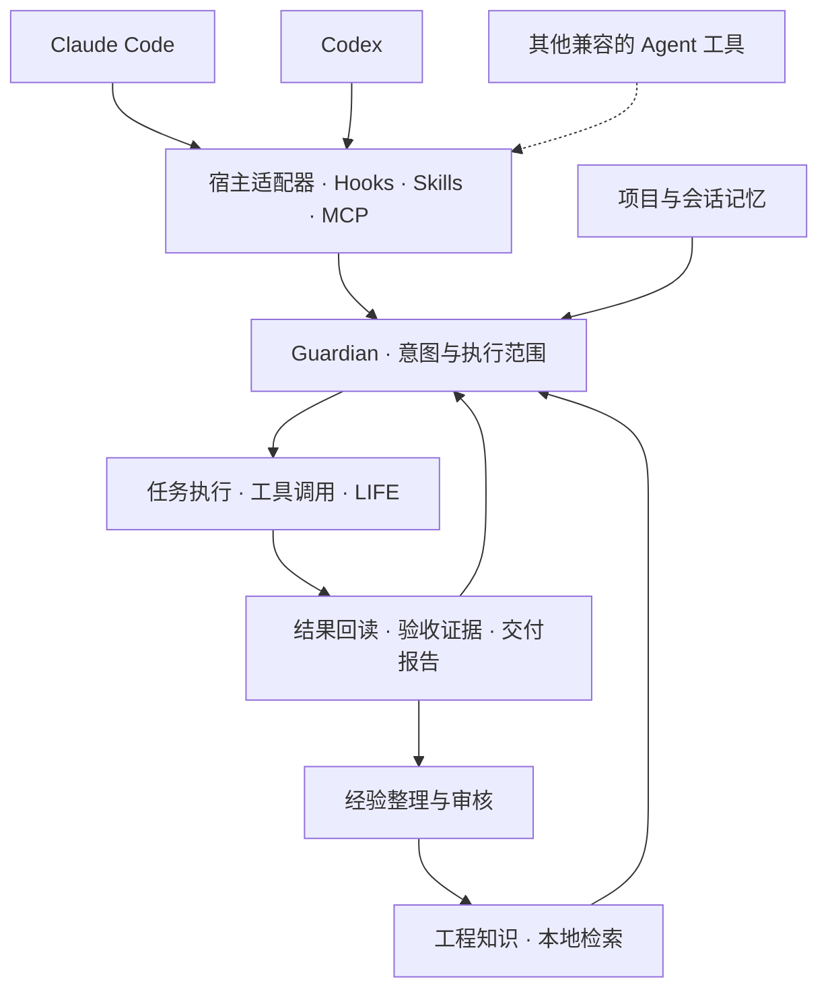

# Sulde

**面向 AI Agent 工具的可扩展 Harness**

[English](README.md) | **简体中文**

[](LICENSE)
[](docs/DEVELOPMENT.zh-CN.md)
[](docs/DEVELOPMENT.zh-CN.md)

Sulde 为 AI 编程 Agent 提供意图监督、任务执行与验收、知识检索和跨会话记忆。
它通过宿主适配器、Hooks、Skills 和 MCP 服务，将任务目标、工具操作与交付证据连接成
可追踪的工程工作流。
实现兼容接口的工具可以复用相应能力；仓库目前提供 Claude Code 和 Codex 的宿主适配器。

**源码可见，限非商业使用。** 具体授权与历史版本边界见[许可证说明](docs/LICENSING.zh-CN.md)。

[特性](#特性) · [架构](#架构) · [快速开始](#快速开始) · [使用示例](#使用示例) · [文档](#文档) · [贡献](#贡献) · [许可证](#许可证)

## 概述

Sulde 面向需要持续上下文、明确执行范围和可验证交付的 Agent 工作流。它把用户目标与
验收标准保存为任务契约，在执行过程中记录可观察的操作与结果，并为后续任务提供可溯源的
工程知识和会话记忆。

项目按协议和宿主能力接入。兼容工具可调用已暴露的 MCP 与 CLI 接口，宿主适配器负责
将生命周期事件、权限决策和执行结果连接到共享核心。现有 Claude Code 与 Codex 适配器
均可独立运行，也可通过配置共享本地知识与记忆。框架保留 Android、iOS、Flutter 和 HarmonyOS 项目模板，核心监督与知识机制
可以用于其他工程项目。

当前仓库提供完整 Harness 的**源码候选版本**。各宿主的安装、权限机制与后台调度需要
在目标环境中分别验证；兼容范围和验收要求见[开发与构建](docs/DEVELOPMENT.zh-CN.md)。

## 特性

- **意图监督** — Guardian 维护可修订的目标、执行范围与验收条件，记录用户纠正和越界处理。
- **可验证执行** — 任务契约、隔离 worktree、工具结果回读和交付报告共同支撑任务验收。
- **工程知识检索** — 通过关键词与向量检索召回相关知识，保留原文路径和适用条件供核验。
- **跨会话记忆** — 保存、检索与整理项目及会话信息，为后续任务恢复必要背景。
- **受约束自动化** — LIFE 提供后台任务与分层治理，在已配置的权限和验收条件下推进工作。
- **兼容协议接入** — 兼容工具可复用 MCP 与 CLI 能力，并通过扩展宿主适配器接入监督和执行流程；已提供 Claude Code 与 Codex 适配器。
- **可扩展工具箱** — 提供项目诊断、Skill/Hook 生成器、知识容器和多端项目脚手架。

## 架构



宿主适配层负责接入原生事件和工具能力，核心层维护任务与执行状态，知识和记忆层提供
历史依据。检索结果需回读原文，工具调用需验证实际结果；状态与权限不会因切换宿主而
自动继承。详细接口见[双宿主契约](docs/dual-runtime-contract.md)和[意图监督](docs/intent-guardian.md)。

### 协议兼容范围

兼容性按工具需要使用的能力判断：

| 接入接口 | 兼容工具需要具备的能力 |
| --- | --- |
| 知识与记忆工具 | MCP 客户端支持本服务的 stdio 传输、初始化、工具发现和工具调用 |
| 项目工具箱 | 能执行文档约定的 CLI 命令并读取输出 |
| Skill 指令 | 能加载相应指令，并正确解析其引用的命令、工具和运行路径 |
| 完整监督与受管执行 | 通过宿主适配器，将会话和工具事件、原生权限决策、执行结果及进程生命周期映射到 Sulde 契约 |

现成宿主适配器与提供方选择器目前覆盖 Claude Code 和 Codex。其他工具可复用匹配的接口；
完整接入需要补齐对应适配并验证。MCP 连接成功本身不代表完整监督流程已兼容。
接入要求见[扩展兼容宿主](docs/DEVELOPMENT.zh-CN.md#扩展兼容宿主)。

## 快速开始

### 环境要求

| 组件 | 要求 |
| --- | --- |
| Python | 3.10–3.14 |
| 基础工具 | Git、PyYAML 6.0+ |
| Agent 工具 | 使用部分能力需兼容对应 MCP/CLI 接口；完整 Harness 需已验证的宿主适配器。已提供 Claude Code、Codex 适配器 |
| 知识与记忆引擎 | 另需索引依赖与模型，由初始化脚本配置 |

独立项目工具箱可直接运行，无需启动 Agent 宿主、模型或 MCP 服务。

### 安装源码工具箱

```sh
git clone https://github.com/EthanReedLabs/sulde-cc.git
cd sulde-cc
python3 -m venv .venv
```

激活环境并检查安装：

```sh
# macOS / Linux
. .venv/bin/activate
python3 -m pip install -r hooks/requirements.txt
python3 -B scripts/sulde.py doctor --strict
```

<details>
<summary>Windows / PowerShell</summary>

```powershell
.venv\Scripts\python.exe -m pip install -r hooks/requirements.txt
.venv\Scripts\python.exe -B scripts/sulde.py doctor --strict
```

后续示例中的 `python3` 在 Windows 上替换为 `.venv\Scripts\python.exe`。

</details>

`doctor` 验证源码布局、基础依赖、插件清单和项目工具箱。以下示例可在仓库根目录直接运行。

### 接入 Agent 宿主

完整 Harness 需要构建对应宿主的插件，并初始化知识与记忆运行环境：

| 宿主 | 接入说明 |
| --- | --- |
| Claude Code | 构建 Claude 插件包，按[双宿主契约](docs/dual-runtime-contract.md)配置对应运行环境 |
| Codex | 构建 POSIX 或 Windows 插件包，使用仓库安装器绑定并验证 Codex 可执行文件 |
| 其他兼容工具 | 通过匹配的 MCP/CLI 接口接入；完整监督和执行流程按[宿主接入要求](docs/DEVELOPMENT.zh-CN.md#扩展兼容宿主)适配 |

构建命令、运行依赖、CLI 兼容版本与验证要求统一维护在[开发与构建](docs/DEVELOPMENT.zh-CN.md)。
初始化可能下载模型并写入本地数据；首次接入应使用独立测试环境。

## 使用示例

### 创建项目知识库

在独立示例目录初始化空知识容器，检查文档格式并生成索引：

```sh
mkdir -p .tmp/sulde-demo
python3 -B scripts/sulde.py kb init --root .tmp/sulde-demo
python3 -B scripts/sulde.py kb lint --root .tmp/sulde-demo
python3 -B scripts/sulde.py kb index --root .tmp/sulde-demo
```

知识库位于 `.tmp/sulde-demo/knowledge/`。初始容器为空，可按[知识工具箱指南](docs/KNOWLEDGE-KIT.md)
添加经过审核的 Markdown 文档，再用症状描述检索：

```sh
python3 -B scripts/sulde.py kb search --root .tmp/sulde-demo "缓存更新导致旧数据覆盖"
```

该 CLI 使用本地词法匹配；完整 Harness 的混合检索引擎另行初始化。空知识库返回空结果。

### 定义可验收的 Agent 任务

接入宿主后，可以用以下结构描述任务，由意图监督与任务工具保存、执行和验证：

```text
目标：修复缓存刷新后旧数据覆盖新数据的问题。
范围：缓存模块及其回归测试，保留现有公共接口。
验收：并发刷新用例通过；已有测试通过；交付变更说明与命令结果。
知识：检索相关案例并核对原文；结论有证据后整理为知识候选。
```

任务契约定义见[任务编写规范](spec/task-authoring.md)，工具与外部操作的结果验证见
[事件观察](docs/event-observability.md)。

## 文档

| 主题 | 文档 |
| --- | --- |
| 核心机制 | [意图监督](docs/intent-guardian.md) · [双宿主运行](docs/dual-runtime-contract.md) · [事件观察](docs/event-observability.md) |
| 任务协议 | [任务编写规范](spec/task-authoring.md) · [任务契约](spec/task-contract.md) |
| 知识与扩展 | [知识工具箱](docs/KNOWLEDGE-KIT.md) · [检索契约](docs/kb-retrieval-contract.md) · [扩展指南](docs/EXTENDING.md) |
| 开发维护 | [开发与构建](docs/DEVELOPMENT.zh-CN.md) · [变更记录](CHANGELOG.md) · [贡献指南](CONTRIBUTING.md) |
| 数据与许可 | [公开数据边界](docs/PUBLIC-DATA-BOUNDARY.md) · [许可说明](docs/LICENSING.zh-CN.md) · [版权声明](NOTICE) · [第三方清单](THIRD_PARTY_NOTICES.zh-CN.md) |

项目首页、开发指南、许可说明与第三方清单提供英文和简体中文版本。其余文档暂保留原语言；
知识工具箱、扩展指南、任务编写与任务契约、贡献指南及公开数据边界为英文，
意图监督、双宿主运行、事件观察与知识检索契约为中文。
文档语言支持不代表 CLI 输出或所有 Skill 已完成本地化。

历史 Community 指南描述独立工具箱，其中旧版能力清单不代表当前完整 Harness 的范围。

## 数据与隐私

仓库分发框架实现和空知识容器。工程知识、项目与会话记忆、索引与向量、生产日志、
安装回执、内部报告、凭据和私有 Git 历史不随源码分发。运行数据保存在使用者配置的本地
Sulde 目录中；模型调用和外部服务的数据边界由实际配置决定。

测试应使用合成数据。分享日志、提交问题或发布衍生包前，按[公开数据边界](docs/PUBLIC-DATA-BOUNDARY.md)
检查并清理敏感内容。

## 贡献

欢迎文档修正、可复现的问题报告、平台兼容性改进，以及通用框架和工具箱的改进。

1. 在 [Issues](https://github.com/EthanReedLabs/sulde-cc/issues) 描述问题、复现步骤与预期行为。
2. 按[贡献指南](CONTRIBUTING.md)确定改动范围；涉及核心协议或许可时先讨论。
3. 提交聚焦单一问题的 Pull Request，附上验证结果。

涉及敏感信息的问题请勿直接公开原始材料，可通过
[维护者邮箱](mailto:eric.gao.tech@gmail.com)联系。贡献保留作者版权，适用仓库贡献许可。

## 许可证

当前新内容采用 [PolyForm Noncommercial License 1.0.0](LICENSE)，允许在其许可目的下
使用、修改与再分发，**不授予商业使用权**。企业内部商业研发、收费交付、转售和商业托管
不在授权范围内；标准条款对教育、公益等组织的明确许可保留。

本项目属于 **source available（源码可见）**。历史 MIT / BSL 已授出的权利继续有效；
新许可没有自动转为 MIT 的日期。完整范围见[许可与使用边界](docs/LICENSING.zh-CN.md)。
