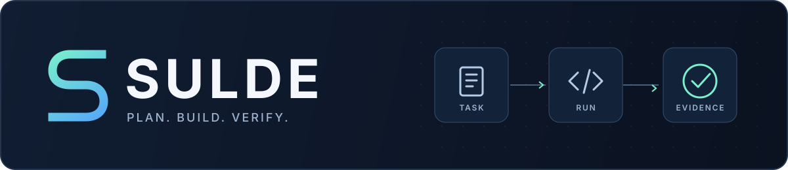

<p align="center">
  
</p>

<h1 align="center">让 AI 编码任务，从需求走到可验证的交付。</h1>

<p align="center">
  为你使用的编码 Agent 提供任务、项目上下文与审核的共同工作流程。<br/>
  明确要做的事，带上积累的经验，核对实际交付的结果。
</p>

<p align="center">
  <a href="#快速开始"><strong>开始使用</strong></a> ·
  <a href="#一个任务从需求到审核">查看工作流程</a> ·
  <a href="#支持的-agent">支持的 Agent</a> ·
  <a href="#文档">阅读文档</a> ·
  <a href="README.md">English</a>
</p>

<p align="center">
  <a href="docs/DEVELOPMENT.zh-CN.md">Claude Code + Codex 适配器</a> &nbsp;·&nbsp;
  <a href="docs/MCP.zh-CN.md">MCP / CLI 接口</a> &nbsp;·&nbsp;
  <a href="LICENSE">MIT 许可</a>
</p>

## 为什么使用 Sulde？

一个编码任务包含的不止是提示词，还有改动范围、项目背景、已有决策，以及怎样才算完成。
Sulde 把这些信息组织到你和编码 Agent 都能核对的工作流程中。

- **任务更清楚。** 执行前记录负责人、依赖、允许改动的范围和验收条件。
- **经验可以复用。** 检索相关工程知识和已记录的会话背景，保留来源供你核对。
- **交付有据可查。** 将改动与检查、报告关联起来，针对未满足的要求继续返修。

Sulde 由个人独立开发和维护。这个仓库提供框架源码与 CLI 工具箱，
可直接从你已有的 Agent 工作流程中调用。

## 支持的 Agent

**任何能调用 CLI 的 Agent 或工具，都可以直接使用 Sulde。** 在你已有的工作流程中调用即可。

<p>
  <a href="https://code.claude.com/docs/en/overview"><kbd> Claude Code</kbd></a> &nbsp;
  <a href="https://github.com/openai/codex"><kbd> Codex</kbd></a> &nbsp;
  <a href="https://cursor.com/docs/cli/overview"><kbd> Cursor</kbd></a> &nbsp;
  <a href="https://docs.github.com/en/copilot/how-tos/copilot-cli/set-up-copilot-cli/install-copilot-cli"><kbd> GitHub Copilot</kbd></a> &nbsp;
  <a href="https://opencode.ai/docs/cli/"><kbd> OpenCode</kbd></a> &nbsp;
  <a href="https://geminicli.com/docs/"><kbd> Gemini CLI</kbd></a> &nbsp;
  <a href="https://docs.cline.bot/usage/cli-overview"><kbd> Cline</kbd></a> &nbsp;
  <a href="https://github.com/continuedev/continue/tree/main/extensions/cli"><kbd> Continue</kbd></a> &nbsp;
  <a href="https://kiro.dev/docs/cli/"><kbd> Kiro</kbd></a> &nbsp;
  <a href="https://qwenlm.github.io/qwen-code-docs/"><kbd> Qwen Code</kbd></a> &nbsp;
  <kbd>+ 任何支持 CLI 的工具</kbd>
</p>

Claude Code 和 Codex 另有内置宿主适配器，提供 Skill、Hook 与受管任务执行。
知识与记忆工具也可通过 MCP 接入。

[CLI 快速开始 →](#快速开始) · [宿主适配器 →](docs/DEVELOPMENT.zh-CN.md) · [MCP 工具 →](docs/MCP.zh-CN.md)

## 一个任务，从需求到审核

**示例：修复缓存刷新时旧数据覆盖新数据的问题。**

| 步骤 | 使用 Sulde 做什么 | 可以核对什么 |
| --- | --- | --- |
| 明确任务 | 确定目标、改动文件、负责人及回归检查。 | 完成标准清楚的任务说明。 |
| 准备上下文 | 检索相关经验，阅读并核对原始来源。 | 相关背景及采纳它的理由。 |
| 执行修改 | 派给 Claude Code 或 Codex；受管任务使用隔离 worktree。 | 代码改动和已记录的执行事件。 |
| 验证结果 | 运行选定的检查，对照任务审核交付报告。 | 与被测改动对应的检查结果。 |
| 返修与积累 | 将未满足的要求交回返修，记录经过验证的经验。 | 范围明确的后续任务和可复用的项目知识。 |

这里展示的是配置后的工作流程示例。具体任务、检查项和验收决定由你与协调 Agent 明确。
底层约定见[任务编写指南](spec/task-authoring.md)。

## 快速开始

**先体验一个小型本地工作流程。** 需要 Git 和 Python 3.10+。
下面的示例使用知识工具箱，不需要 Agent 账号、模型或 MCP 服务。

**1. 准备源码工具箱**

```sh
git clone https://github.com/EthanReedLabs/sulde.git
cd sulde
python3 -m venv .venv
. .venv/bin/activate
python -m pip install -r hooks/requirements.txt
python -B scripts/sulde.py doctor --strict
```

<details>
<summary>Windows / PowerShell</summary>

克隆仓库后，运行 `py -3 -m venv .venv` 创建环境。
用 `.venv\Scripts\python.exe -m pip install -r hooks/requirements.txt` 安装依赖，
并将下文的 `python` 替换为 `.venv\Scripts\python.exe`。

</details>

**2. 保存并检索一条经验**

在仓库根目录运行，使用尚未创建的 `.tmp/sulde-demo` 目录：

```sh
python -B scripts/sulde.py kb init --root .tmp/sulde-demo
python -c "from pathlib import Path; Path('.tmp/sulde-demo/lesson.md').write_text('Ignore an older cache refresh response after a newer request has completed.', encoding='utf-8')"
python -B scripts/sulde.py kb add --root .tmp/sulde-demo --container anti-patterns --title "Stale cache refresh" --summary "Keep newer cache results from being overwritten." --body .tmp/sulde-demo/lesson.md
python -B scripts/sulde.py kb lint --root .tmp/sulde-demo
python -B scripts/sulde.py kb search --root .tmp/sulde-demo "stale cache refresh"
```

格式检查应返回 `"documents": 1` 和 `"errors": []`。检索应找到 **Stale cache refresh**，
文档 ID 为 `anti-patterns/stale-cache-refresh`。新文档处于草稿状态，审核后再作为项目参考。

这个工具箱使用本地词法检索。完整知识与记忆运行时有独立的依赖和初始化步骤，
详见[知识工具箱](docs/KNOWLEDGE-KIT.md)和 [MCP 指南](docs/MCP.zh-CN.md)。

**3. 接入你需要的能力**

| 下一步想做什么 | 接入指南 |
| --- | --- |
| 在 Claude Code 或 Codex 中使用 Sulde | [构建并配置宿主适配器](docs/DEVELOPMENT.zh-CN.md) |
| 从兼容 MCP 的客户端调用知识与记忆 | [配置本地 MCP 服务](docs/MCP.zh-CN.md) |
| 定义并派发一个工程任务 | [编写第一份任务说明](spec/task-authoring.md) |

宿主适配器以源码候选形式提供。启用完整工作流程前，请核对所选版本的 CLI 兼容要求和安装说明。

## 可以用它做什么

| 能力 | 为工作带来什么 |
| --- | --- |
| **任务编排** | 围绕明确任务组织负责人、依赖、范围、派单与验收。 |
| **知识与记忆** | 跨项目、跨会话检索工程经验和已经记录的上下文。 |
| **执行观察** | 通过已配置的适配器观察宿主事件、工具操作和结果。 |
| **验证与返修** | 将检查和交付报告关联到任务，保留继续返修的路径。 |
| **项目扩展** | 添加 Skill、Hook、检查项、知识容器和项目约定。 |
| **项目模板** | 从 Android、iOS、Flutter、HarmonyOS 模板起步，在其他项目复用通用工具。 |

## 架构

```text
任务说明 → 宿主适配器 → 执行 → 检查与证据 → 审核 / 返修
               ↕                  ↕
           项目知识与已记录的会话上下文
```

宿主适配器把 Claude Code 或 Codex 连接到共享运行时；Skill 提供工作指引，
CLI 与 MCP 暴露具体能力。受管执行增加隔离 worktree 和与任务关联的交付报告。
[了解宿主运行契约 →](docs/dual-runtime-contract.md)

## 几个实际问题

**可以只用知识工具吗？**

可以。本地工具箱可独立运行。MCP 服务另行提供知识、记忆、状态和事件工具；
连接 MCP 本身不会启用完整任务流程。

**安装后会自动记住所有对话吗？**

记忆检索依赖已记录的数据。会话导入和后台维护需要单独配置，
建立 MCP 连接本身不会自动采集客户端的会话历史。

**数据保存在哪里？**

知识和记忆使用你配置的本地数据目录。向连接的客户端、模型或外部服务发送什么数据，
由实际配置决定。详见[数据边界](docs/PUBLIC-DATA-BOUNDARY.md)。

## 文档

| 开始使用 | 深入了解 |
| --- | --- |
| [宿主配置与构建](docs/DEVELOPMENT.zh-CN.md) | [宿主运行契约](docs/dual-runtime-contract.md) |
| [知识工具箱](docs/KNOWLEDGE-KIT.md) | [任务契约](spec/task-contract.md) |
| [MCP 接入与工具](docs/MCP.zh-CN.md) | [事件观察](docs/event-observability.md) |
| [任务编写](spec/task-authoring.md) | [扩展指南](docs/EXTENDING.md) |

## 参与贡献

欢迎提供可复现的问题、改进难懂的说明，或分享可复用的工程示例。
请先阅读[贡献指南](CONTRIBUTING.md)，也可以[提交 Issue](https://github.com/EthanReedLabs/sulde/issues)。
如果 Sulde 对你有帮助，点一个 Star，让更多开发者找到它。

## 许可证

按 [MIT License](LICENSE) 开源，可用于商业用途，须保留版权与许可声明。
适用范围及历史版本说明见[许可指南](docs/LICENSING.zh-CN.md)。

---

**从一个能核对结果的任务开始。** [开始使用 ↑](#快速开始)
